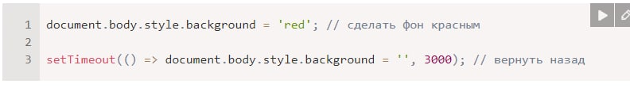
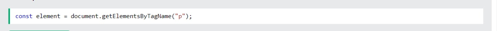

# Titan-01
#  Dom-дерево
### Основой HTML-документа являются теги.
### («Document Object Model», коротко DOM)
### тег является объектом
#### Вложенные теги являются «детьми» родительского элемента. Текст, который находится внутри тега, также является объектом.
### Если запустить этот код, то <body> станет красным на 3 секунды:

#### DOM – это представление HTML-документа в виде дерева тегов. Вот как оно выглядит:

# DOM - Searching: getElement, querySelector
### Агар элемент id дошта бошад аттрибут, мо метавонем онро ба даст орем элемент бо истифода аз усул document.getElementById(i г), новобаста аз он ки он дар куҷост. Масалан

## Get-Element ay Html ba Js megira 
## Example

### Если вы хотите найти все элементы HTML, которые соответствуют указанному селектору CSS (идентификатор, имена классов, типы, атрибуты, значения атрибутов и т. д.), используйте метод querySelectorAll().

